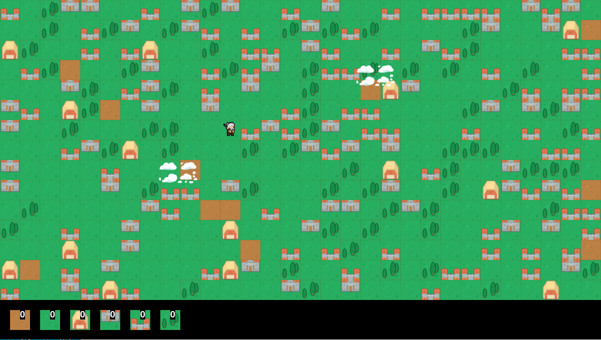

# Lyria - Global Game Jam 2020
A game by Lucas Pompeu

## Sinopse
A vila de Lyria foi totalmente destruída por um estranho fenômeno mágico, cabe a Geraldo, o bruxo-artesão da vila, reparar todo o dano juntamente com sua espada e poderes mágicos numa aventura pela era medieval.

#### Gênero: Sandbox
#### Plataformas: MS Windows e Linux
#### Requisitos: Python 3.8; Pygame;

### Ideia central do jogo:
Reorganizar e reparar a vila da maneira que o jogador quiser, recolhendo os quadros de elementos e podendo rearanjar em outro lugar.

### Controles:
← → ↑ ↓ setas direcionais para movimentar

espaço para recolher os quadros e transformr em quadro barro

1 para barro

2 para grama

3 para celeiro

4 para parte de baixo do castelo

5 para parte de cima do castelo

6 para árvore

### Licença 
Licença MIT
